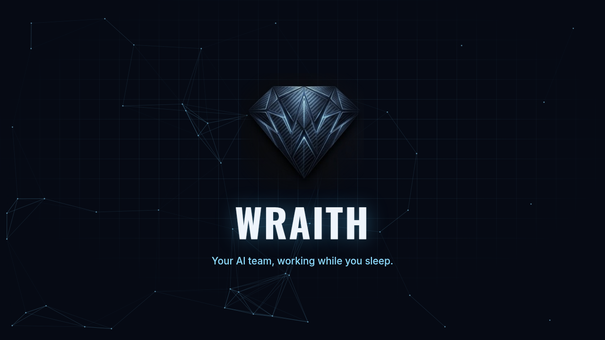

# Wraith — Overview



**Your AI team, working while you sleep.**

Wraith runs an autonomous AI agent team on Claude Code. Talk to it on Telegram or Slack — it remembers, schedules, delegates across agents, and keeps working in the background.

> Looking for the fully designed, interactive version of this page? [Open the styled overview](overview.html) locally (download the file and open it in a browser) — GitHub shows `.html` files as source code, not as a rendered page.

## Purpose

Not a chatbot — an AI team that works on its own. Wraith fills the gap where a chatbot stops: it doesn't wait for a prompt, it notices what needs doing, keeps context, and carries long tasks through unsupervised.

- **Proactive, not reactive** — Heartbeat watches your calendar, email, and kanban in silence, and only speaks up when it actually matters.
- **A team, not one agent** — Spin up specialized agents with their own personality and channel; they delegate to each other, all visible on one Mission Control dashboard.
- **Remembers and learns** — Layered hot/warm/cold memory with hybrid search, and it writes itself reusable skills from work that succeeds.
- **Your brand, your rules** — Fully renameable and brandable at install; secrets stay behind a Vault, access is managed per SSH key.

## How it works

A Claude Code engine, wrapped in its own infrastructure.

Each agent is a Claude Code worker in its own tmux session, with its own `CLAUDE.md` instructions, `SOUL.md` personality, and isolated config. The Node.js/TypeScript core starts, watches, and restarts them, and serves the Mission Control dashboard over HTTP (`localhost:3420` by default).

Agent-to-agent messages run through an internal queue. Memory lives in a layered SQLite database, searched with a hybrid of FTS5 full-text and Ollama `nomic-embed-text` vectors (RRF fusion). A cron-based runner drives scheduled tasks and heartbeat checks; MCP connectors (Gmail, Calendar, Drive, Notion, Slack, and more) reach external services, with credentials held in an AES-256-GCM Vault.

The system heals and improves itself: code self-heal diagnoses and fixes crashes and test failures via PRs, and skill-factory turns recurring work into reusable skills — both gated by guardrails and a staged autonomy ladder.

| | |
|---|---|
| **Runtime** | Node.js 20+, TypeScript 5 |
| **Engine** | Claude Agent SDK / Claude Code CLI |
| **Storage** | SQLite — FTS5 + vector (RRF fusion) |
| **Embeddings** | Ollama — nomic-embed-text |
| **Channel** | Telegram Bot API or Slack Socket Mode |
| **Isolation** | one tmux session per agent |
| **Secrets** | Vault — AES-256-GCM + OS keychain |
| **Dashboard** | built-in web server, port 3420 |

## Features

| | |
|---|---|
| **Agent fleet** | Multiple agents, each with its own channel, personality, and memory; inter-agent delegation. |
| **Mission Control** | Web dashboard for the whole team, its tasks, and its schedules. |
| **Kanban** | AI auto-breakdown task board — swimlanes, WIP limits, card aging, subtasks. |
| **Heartbeat** | Silent background monitoring with a staged autonomy ladder; only speaks up when it matters. |
| **Memory** | Hot/warm/cold tiers, hybrid FTS5 + vector search, daily salience decay. |
| **Schedules** | Cron-based tasks with a daily timeline and weekly view on the dashboard. |
| **Skill-factory** | Agents learn from their own work and write themselves reusable skills. |
| **Federation** | Links multiple Wraith instances with qualified addressing and auto-routing. |
| **Vault** | Encrypted secret store for API keys and passwords — plaintext never touches the config. |
| **Dream-engine** | Overnight knowledge consolidation with morning priority suggestions. |
| **Voice** | Per-agent STT+TTS, local voice round-trip over Telegram. |
| **Background tasks** | Detached, long-running jobs with a notification on completion. |

## Usage

From install to first message.

```bash
# macOS / Linux
git clone --branch main https://github.com/MRXH4X/wraith.git
cd wraith
./install.sh
```

A one-line installer covers Windows (WSL); VPS/EC2 installs headless with `CLAUDE_CODE_OAUTH_TOKEN`. The installer asks for the bot and brand name, the channel provider (Telegram or Slack), and any required API keys.

1. **Open the dashboard** — `localhost:3420`, where you see and run the whole team.
2. **Message the bot** — on Telegram or Slack, Wraith replies and gets to work.
3. **Create agents** — on the Team page, each with its own `CLAUDE.md` and `SOUL.md`.
4. **Set up schedules** — for recurring tasks and silent heartbeat checks.
5. **Manage the Vault** — encrypted API keys for every MCP connector, in one place.

---

Node.js 20+ · TypeScript 5 · SQLite (FTS5 + Vector) · Claude Agent SDK · Telegram / Slack · MIT License

Built by **MRXH4X** · [github.com/MRXH4X/wraith](https://github.com/MRXH4X/wraith)
